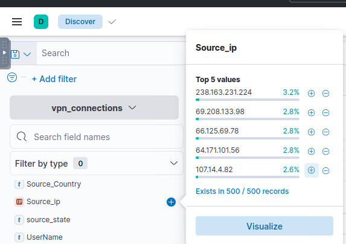
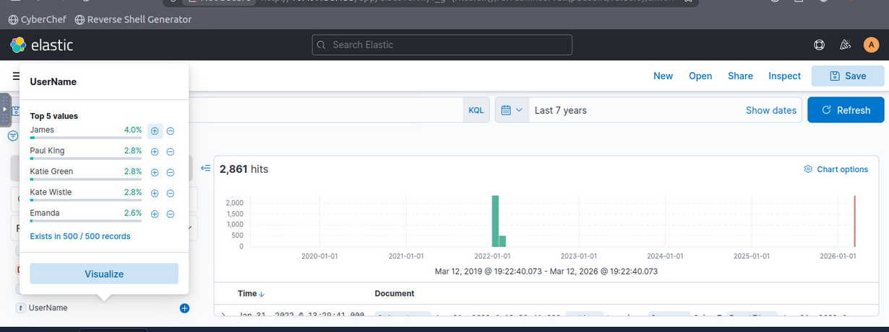
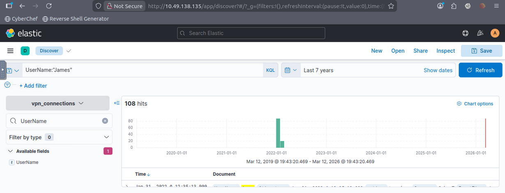
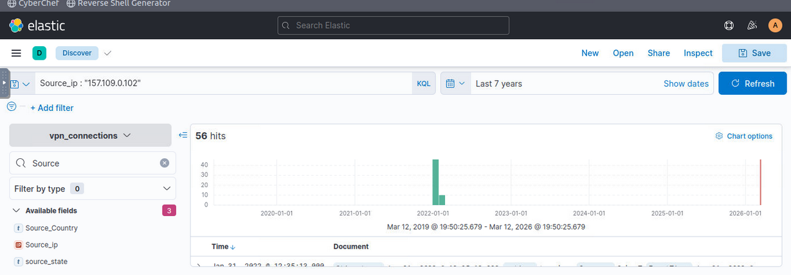

# ELK Log Analysis

## Description

This project demonstrates basic log analysis using the ELK stack.  
The investigation was performed using Kibana to search, filter, and analyze log events.

## Tools Used

- Elasticsearch
- Logstash
- Kibana
- Log analysis techniques

## Investigation Screenshots

### Viewing VPN Logs

### Filtering Login Events

### Investigating Source IP Addresses

### Investigating VPN Users

### Investigating a Specific User

The query `UserName:"James"` was used to identify VPN login events associated with a specific user.

### Investigating a Specific IP Address

The query `Source_ip:"157.109.0.102"` was used to investigate VPN activity originating from a specific IP address.

## Findings

- VPN login events were successfully identified using the query `action:"built"`.
- A total number of login events were observed within the selected time range.
- Source IP addresses were analyzed to determine where VPN connections originated.
- User activity analysis showed that specific users generated multiple VPN login events.

This investigation demonstrates how ELK can be used to filter, search, and analyze log data in a security monitoring environment.