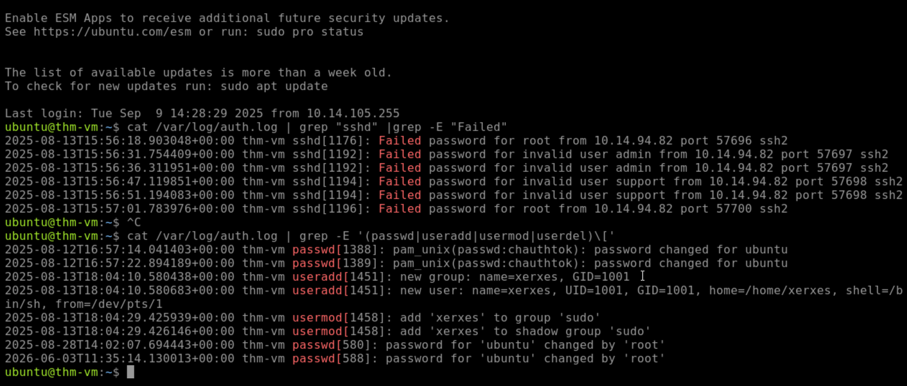

# Linux Authentication Log Investigation

## Overview

This investigation focused on analyzing Linux authentication logs located in:

```bash
/var/log/auth.log
```

The goal was to identify failed SSH login attempts and investigate user account creation events.

---

## Investigation 1: Failed SSH Logins

### Objective

Identify the IP address responsible for multiple failed SSH login attempts.

### Command Used

```bash
cat /var/log/auth.log | grep -E "Failed"
```

### Findings

The following IP address attempted to authenticate against multiple user accounts:

```text
10.14.94.82
```

This activity may indicate brute-force or password-spraying behavior.

---

## Investigation 2: User Creation and Privilege Escalation

### Objective

Identify newly created users and determine whether they received administrative privileges.

### Command Used

```bash
cat /var/log/auth.log | grep -E '(passwd|useradd|usermod|userdel)\['
```

### Findings

A user named:

```text
xerves
```

was created and added to the sudo group.

This grants administrative privileges and should be reviewed during an incident investigation.

---

## Evidence



---

## Skills Demonstrated

- Linux Log Analysis
- Authentication Log Investigation
- SSH Attack Detection
- User Account Monitoring
- Privilege Escalation Analysis
- Command-Line Log Filtering
