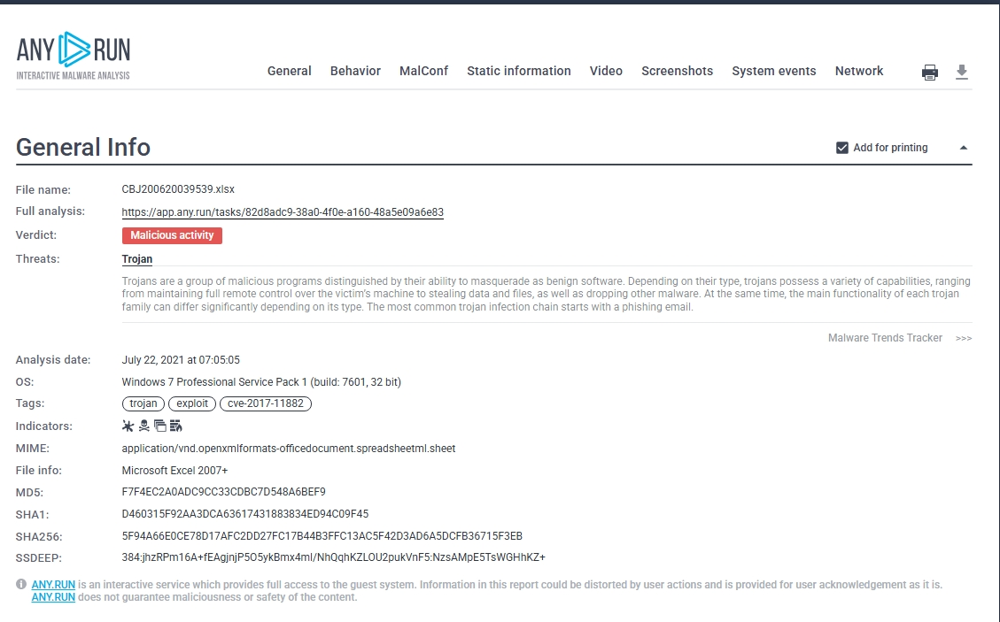

# Phishing Investigation – Advanced (Malicious Attachment Analysis)

## Overview
This investigation analyzes a phishing email containing a malicious Excel attachment.  
The file was examined using an interactive malware sandbox to identify its behavior, indicators of compromise (IOCs), and associated vulnerabilities.

The objective was to determine whether the attachment is malicious and understand how it operates within a system.

---

## Objectives
- Analyze phishing email attachment
- Identify malicious behavior using sandbox analysis
- Extract indicators of compromise (IOCs)
- Determine exploited vulnerabilities
- Understand attacker techniques

---

## Analysis Environment
- Tool Used: ANY.RUN (Interactive Malware Sandbox)
- OS Environment: Windows 7 (Sandbox)
- Analysis Type: Dynamic Analysis

---

## File Details
- **File Name:** CBJ200620039539.xlsx  
- **File Type:** Microsoft Excel Document  
- **SHA256 Hash:**  
  `5f94a66e0ce78d17afc2dd27fc17b44b3ffc13ac5f42d3ad6a5dcfb36715f3eb`

---

## Threat Classification
- **Verdict:** Malicious Activity  
- **Malware Type:** Trojan  

The file disguises itself as a legitimate Excel document but executes malicious code when opened.

---

## Behavior Analysis
The sandbox analysis revealed the following behaviors:

- Execution of **Equation Editor exploit**
- Creation of files in the user directory
- System reconnaissance (computer name, registry access)
- Execution of additional processes
- Attempts to communicate with external infrastructure

---

## Indicators of Compromise (IOCs)

### Malicious Domains (Defanged)
# Phishing Investigation – Advanced (Malicious Attachment Analysis)

## Overview
This investigation analyzes a phishing email containing a malicious Excel attachment.  
The file was examined using an interactive malware sandbox to identify its behavior, indicators of compromise (IOCs), and associated vulnerabilities.

The objective was to determine whether the attachment is malicious and understand how it operates within a system.

---

## Objectives
- Analyze phishing email attachment
- Identify malicious behavior using sandbox analysis
- Extract indicators of compromise (IOCs)
- Determine exploited vulnerabilities
- Understand attacker techniques

---

## Analysis Environment
- Tool Used: ANY.RUN (Interactive Malware Sandbox)
- OS Environment: Windows 7 (Sandbox)
- Analysis Type: Dynamic Analysis

---

## File Details
- **File Name:** CBJ200620039539.xlsx  
- **File Type:** Microsoft Excel Document  
- **SHA256 Hash:**  
  `5f94a66e0ce78d17afc2dd27fc17b44b3ffc13ac5f42d3ad6a5dcfb36715f3eb`

---

## Threat Classification
- **Verdict:** Malicious Activity  
- **Malware Type:** Trojan  

The file disguises itself as a legitimate Excel document but executes malicious code when opened.

---

## Behavior Analysis
The sandbox analysis revealed the following behaviors:

- Execution of **Equation Editor exploit**
- Creation of files in the user directory
- System reconnaissance (computer name, registry access)
- Execution of additional processes
- Attempts to communicate with external infrastructure

---

## Indicators of Compromise (IOCs)

### Malicious Domains (Defanged)
biz9holdings[.]com
findresults[.]site
ww38[.]findresults[.]site

---

### Malicious IP Addresses (Defanged)
75[.]2[.]11[.]242
103[.]224[.]182[.]251
204[.]11[.]56[.]48

---

## Exploited Vulnerability
- **CVE-2017-11882**

This is a known Microsoft Office vulnerability commonly used in phishing attacks to execute malicious code via crafted documents.

---

## Analysis Summary
The phishing email delivers a malicious Excel attachment that exploits a known vulnerability to execute code on the victim's machine.  

The malware demonstrates characteristics of a Trojan, including stealth execution, system interaction, and communication with attacker-controlled infrastructure.

---

## Key Takeaways
- Email attachments remain a major phishing vector  
- Known vulnerabilities are still actively exploited  
- Sandbox analysis is critical for safe malware investigation  
- IOC extraction helps in threat detection and prevention  

---

## Tools Used
- ANY.RUN (Malware Sandbox)
- TryHackMe AttackBox
- CyberChef (for decoding where necessary)

---

## Conclusion
This investigation highlights the importance of analyzing suspicious attachments in a controlled environment.  

By leveraging sandbox analysis and IOC extraction, defenders can detect, understand, and mitigate phishing-based malware threats effectively.

##  Analysis Environment

## Indicators of Compromise (IOCs)

