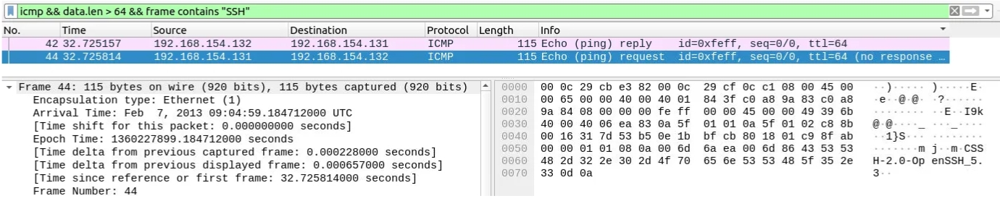
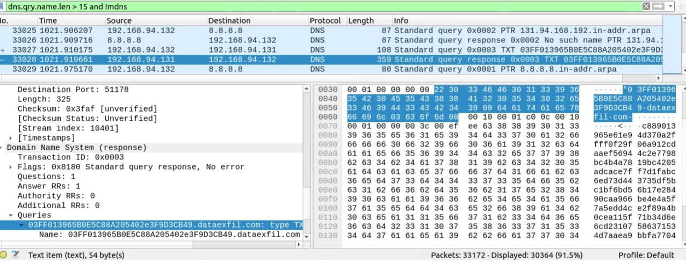

# Wireshark ICMP & DNS Tunnelling Analysis (SOC Lab)

## Objective
This investigation was done using Wireshark to identify possible ICMP and DNS tunnelling activity that could indicate data exfiltration or command-and-control communication.

## Analysis

ICMP traffic was analysed using the filter:

data.len > 64 and icmp

This revealed packets with unusually large payloads, which is not normal for standard ICMP (ping) traffic. Further analysis was done using:

(data.len > 64) and (icmp contains "ssh" or icmp contains "ftp" or icmp contains "tcp" or icmp contains "http")

The results showed that ICMP packets contained references to SSH traffic, suggesting that ICMP is being used to carry hidden or encapsulated data. This is a strong indicator of ICMP tunnelling.

ICMP traffic showed unusually large payloads as seen below:

DNS traffic was also analysed using:

dns.qry.name.len > 15 and !mdns

This produced a very large number of packets, making it difficult to manually inspect results. The filter was refined to focus on more suspicious queries:

dns.qry.name.len > 40 and !mdns

and further narrowed to:

dns.qry.name.len > 40 and !mdns && dns.qry.name contains ".com"

This revealed long, encoded DNS queries directed toward a single domain. The suspicious main domain identified was:

dataexfil[.]com

The DNS queries appeared abnormal due to their length and structure, suggesting possible encoded data being transmitted through DNS tunnelling.

DNS queries showed long encoded subdomains:

## Findings

ICMP traffic showed signs of embedded SSH-related data, indicating possible tunnelling activity. DNS traffic showed long and encoded subdomain queries pointing to a single domain, which is consistent with DNS tunnelling used for data exfiltration.

## Conclusion

Both ICMP and DNS protocols were found to be potentially abused for covert communication. ICMP may be carrying hidden SSH traffic, while DNS is being used with long encoded queries to transfer data externally. These patterns are consistent with tunnelling techniques used in malicious activity.
