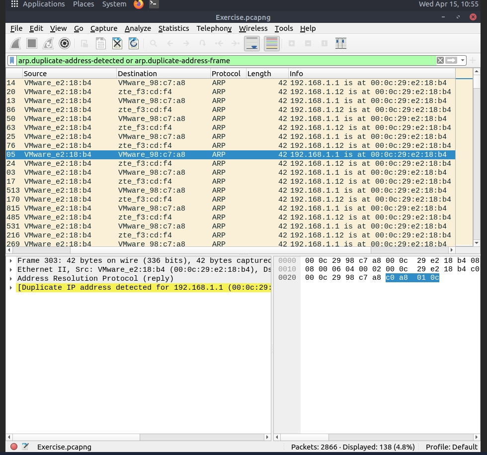
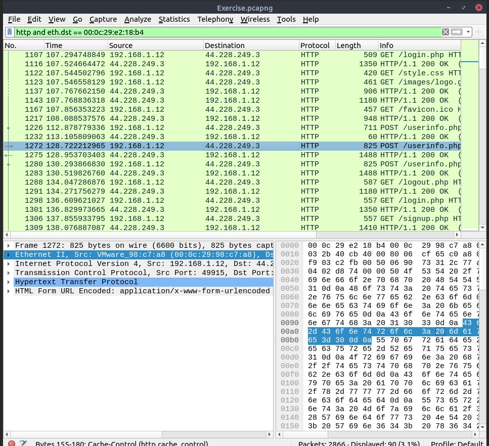
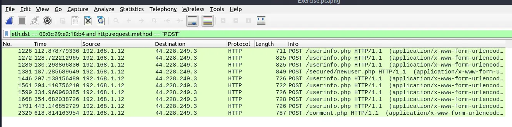

# ARP Spoofing / MITM Investigation – Findings

## 1. Attacker Identification & ARP Spoofing Detection

### Filter Used
- arp.duplicate-address-detected or arp.duplicate-address-frame

### Observation
Analysis of ARP traffic revealed duplicate IP address mappings. A single MAC address was associated with multiple IP addresses, indicating suspicious behavior.

### Evidence

### Result
- Attacker MAC Address: 00:0c:29:e2:18:b4
- Spoofed IP Addresses:
  - 192.168.1.1 (Gateway)
  - 192.168.1.12

### Analysis
The MAC address 00:0c:29:e2:18:b4 was observed claiming multiple IP addresses, including the default gateway. This behavior is consistent with ARP spoofing, where an attacker impersonates the gateway to intercept network traffic.

### Conclusion
The attacker successfully positioned themselves as a Man-in-the-Middle (MITM) by poisoning the ARP table and redirecting traffic through their device.

---

## 2. ARP Request Activity by Attacker

### Filter Used
- arp.opcode == 1 and eth.src == 00:0c:29:e2:18:b4

### Observation
ARP request packets originating from the attacker MAC address were analyzed to determine the level of network interaction.

### Evidence

### Result
- Total ARP requests crafted by attacker: 50 packets

### Analysis
A high number of ARP requests indicates active manipulation of the network's ARP table, likely to maintain MITM positioning and ensure continuous traffic interception.

### Conclusion
The attacker generated multiple ARP requests to sustain spoofing activity and remain in control of network traffic flow.

---

## 3. HTTP Traffic Intercepted by Attacker

### Filter Used
- http and eth.dst == 00:0c:29:e2:18:b4

### Observation
HTTP traffic directed toward the attacker MAC address was identified, confirming interception of network communications.

### Evidence

### Result
- Total HTTP packets received by attacker: 90

### Analysis
The presence of HTTP traffic sent to the attacker indicates successful interception of unencrypted web traffic. This suggests that victims' communications were being monitored.

### Conclusion
The attacker successfully captured HTTP traffic, demonstrating effective Man-in-the-Middle positioning.

---

## 4. Credential Sniffing Detection

### Filter Used
- eth.dst == 00:0c:29:e2:18:b4 and http.request.method == "POST"

### Observation
HTTP POST requests were analyzed to identify potential credential submissions. POST requests typically contain sensitive data such as usernames and passwords.

### Evidence

### Result
- Total sniffed credential entries: 6

### Analysis
Inspection of POST request payloads revealed transmitted login data in clear text. This indicates that sensitive credentials were exposed due to lack of encryption (HTTP instead of HTTPS).

### Conclusion
The attacker was able to capture user credentials, confirming the impact of the MITM attack and highlighting the risk of transmitting sensitive data over unsecured protocols.
---
